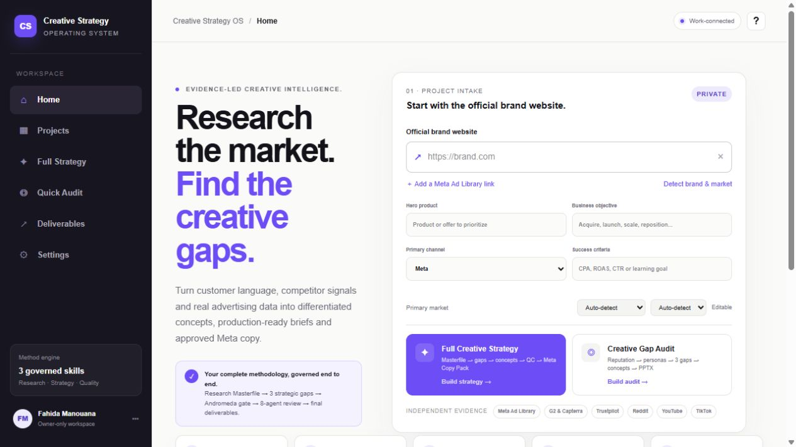
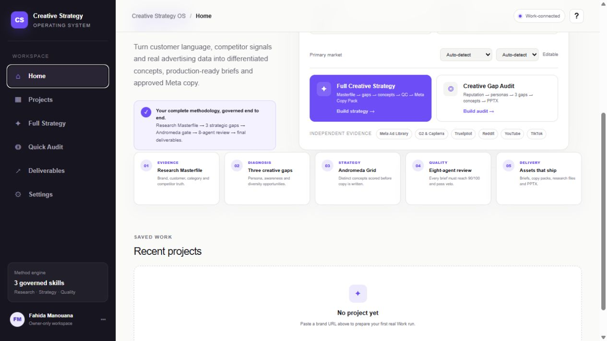
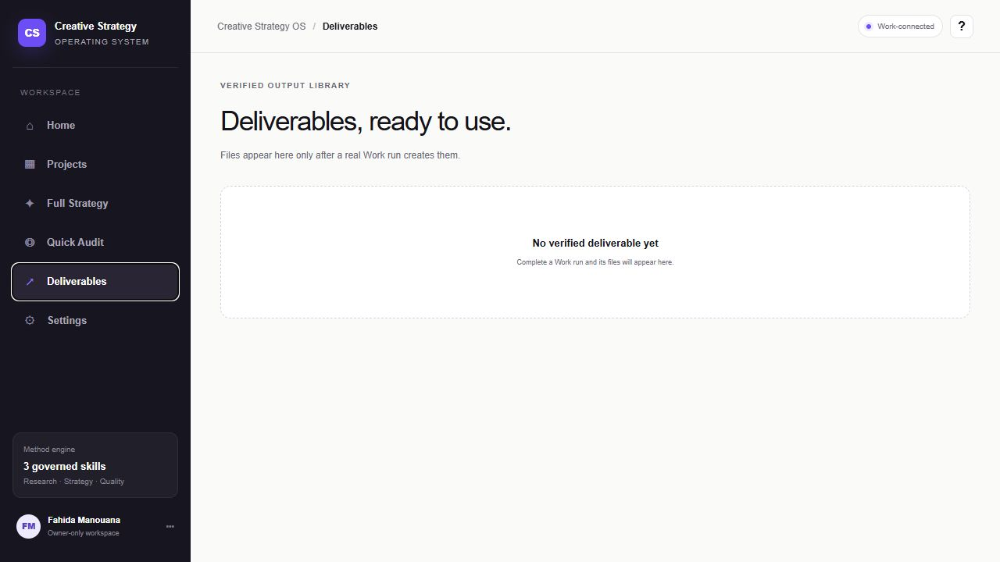

# Creative Strategy OS

**An open, evidence-led system that turns customer, market, competitor, and advertising signals into clear creative direction.**

Creative Strategy OS helps growth marketers and creative teams move from scattered research to strategic gaps, differentiated concepts, production-ready briefs, paid-social copy, and a testing roadmap.

The repository includes the two real Agent Skills behind the workflows:

- **[Full Creative Strategy](skills/full-creative-strategy/SKILL.md)** for the complete research-to-production system
- **[Quick Creative Audit](skills/creative-audit/SKILL.md)** for a focused diagnosis and prioritized roadmap



Built by [Fahida Cécile](https://github.com/fahidacecile), a Growth Marketer and marketer-builder working across GTM, creative strategy, data, and AI-assisted marketing systems.

## Use Creative Strategy OS with Claude

### Choose a workflow

| Choose | When you need | Main outputs |
| --- | --- | --- |
| **Full Creative Strategy** | A complete strategy, concept system, briefs, copy, and testing plan | Research Masterfile, personas, awareness map, competitor benchmark, creative gaps, concepts, briefs, copy, QC report, roadmap |
| **Quick Creative Audit** | A faster diagnosis of what the current creative ecosystem is missing | Customer-language signals, visible ad reality, persona/awareness/diversity gaps, priority concepts, roadmap |

### Quick start

1. Download or clone this repository.
2. Choose the folder for the workflow you want:
   - `skills/full-creative-strategy/`
   - `skills/creative-audit/`
3. To use it in Claude, create a ZIP containing that skill folder as its root, then go to **Customize > Skills > + Create skill > Upload a skill** and enable it.
4. Start with a brand URL, market, and output language.
5. Add a hero product, paid channel, business objective, or first-party files when available.

The skills follow the open [Agent Skills specification](https://agentskills.io/specification). Your client must support Agent Skills and web access is required for live research. A JavaScript-capable browser may be necessary for public ad libraries.

### Example requests

**Full strategy**

```text
Use Full Creative Strategy for https://example.com.
Market: United States. Language: English. Channel: Meta.
Detect the hero product and five direct competitors.
Use independent customer evidence and never invent inaccessible data.
Deliver the Research Masterfile, strategic diagnosis, 10 concepts,
3 production-ready briefs, copy, QC report, and 90-day testing roadmap.
```

**Audit**

```text
Run a Quick Creative Audit for https://example.com.
Market: France. Language: English. Hero product: detect from the site.
Inspect visible Meta ads and independent customer evidence.
Identify persona, awareness, diversity, proof, and competitive gaps,
then recommend 3 priority concepts and a 90-day roadmap.
```

If evidence is blocked or insufficient, both skills must state the limitation and lower confidence rather than simulate research.

## From evidence to production


| Stage | Decision | Output |
| --- | --- | --- |
| **Evidence** | What is true, observable, contradicted, or still unknown? | Research Masterfile and source register |
| **Diagnosis** | Which audience and creative opportunities matter most? | Personas, awareness map, competitor benchmark, creative gaps |
| **Strategy** | Which territories and concepts are distinct and testable? | Creative grid and prioritized concepts |
| **Production** | Can a creator or designer execute without guessing? | Production-ready briefs, scripts, and copy |
| **Quality** | Are the strategy, proof, brand, copy, and format ready? | Diversity gate and eight-part QC report |
| **Learning** | What will the team test and learn next? | Creative testing roadmap and traceability table |



## The problem it solves

Creative teams rarely lack ideas. They lack a reliable way to connect customer evidence, competitive context, creative diversity, and production decisions.

Research is often scattered across brand sites, independent reviews, ad libraries, social platforms, and personal documents. Creative Strategy OS creates one traceable path from raw evidence to a decision a team can produce, test, and learn from.

## What makes the system useful

- Independent customer evidence is separated from brand-owned messaging.
- Observations, interpretations, hypotheses, and recommendations remain distinct.
- Persona, awareness, diversity, proof, and competitive-whitespace gaps shape the strategy.
- Concepts are designed as meaningfully different strategic ideas, not cosmetic variants.
- Platform-specific scoring is used carefully; unavailable metrics are never invented.
- Every production brief includes a proof path, claim boundary, hypothesis, and measurement plan.
- Final copy passes an eight-part review with a 90/100 threshold and mechanical veto.
- Recommendations remain linked to their supporting evidence.

## Two modes

### Full Creative Strategy

The complete workflow covers project intake, brand and product research, independent customer evidence, dynamic verbatim collection, market and competitor analysis, visible advertising, personas, awareness, objections, proof, creative territories, a diverse concept matrix, production briefs, copy, quality control, and a testing roadmap.

[Open the Full Creative Strategy Skill](skills/full-creative-strategy/SKILL.md) · [View the fictional example](skills/full-creative-strategy/examples/selected-output.md)

### Quick Creative Audit

The focused workflow compares customer and category reality with what the brand visibly runs. It prioritizes persona, awareness, and creative-diversity gaps, then adds proof or competitive-whitespace gaps when evidence supports them.

[Open the Quick Creative Audit Skill](skills/creative-audit/SKILL.md) · [View the fictional example](skills/creative-audit/examples/selected-output.md)

## Product preview

### Project intake and strategy modes


### Evidence-to-delivery workflow


### Deliverables workspace



## Quality and evidence standards

- Never fabricate reviews, ads, spend, performance, customers, results, or market data.
- Treat `not observed` as different from `does not exist`.
- Date every ad observation and preserve source URLs.
- Disclose sample sizes, blocked sources, contradictions, and uncertainty.
- Treat visible ad frequency or duration as a signal, not proof of performance.
- If platform-native similarity data is unavailable, mark it `not measured`.
- Review claims against available proof before approving copy.

## Repository map

```text
skills/
├── full-creative-strategy/
│   ├── SKILL.md
│   ├── references/
│   ├── templates/
│   └── examples/
└── creative-audit/
    ├── SKILL.md
    ├── references/
    ├── templates/
    └── examples/
```

The examples use a fictional brand and are intentionally explicit about what cannot be claimed without real evidence.

## Why this is open

The methodology is published in full because the value of creative strategy does not come from hiding a prompt. It comes from judgment: choosing the right evidence, interpreting contradictions, identifying the most valuable gap, writing a differentiated concept, protecting claim quality, and translating strategy into work a team can actually produce.

## License

The original skills, templates, examples, and documentation in this repository are available under the [MIT License](LICENSE). Third-party brand names, trademarks, platform interfaces, and source material remain the property of their respective owners.

## About the builder

I am **Fahida Cécile**, a Growth Marketer and marketer-builder combining GTM, creative strategy, business analysis, and AI-assisted workflows to solve practical marketing problems.

[GitHub profile](https://github.com/fahidacecile) · [Portfolio](https://fahidagrowthportfolio.netlify.app/) · [LinkedIn](https://www.linkedin.com/in/fmanouana/)
